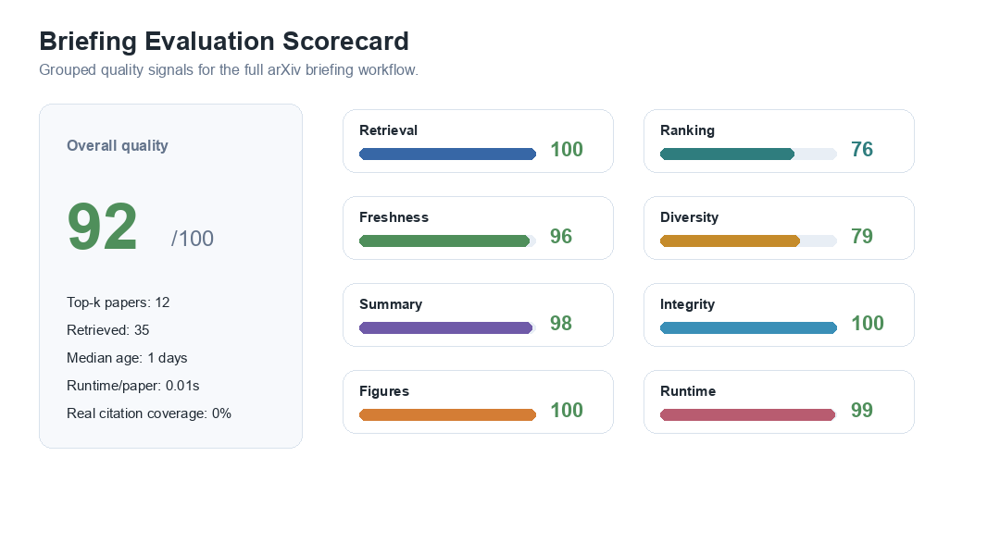
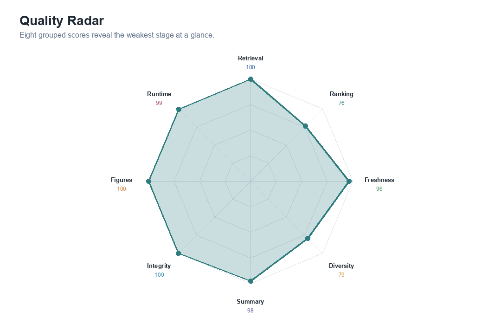
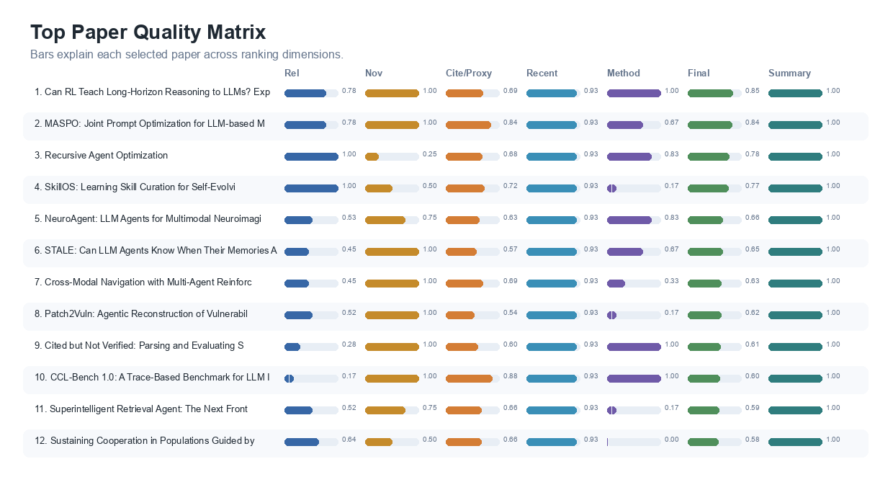
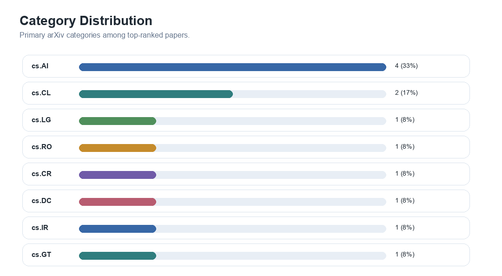
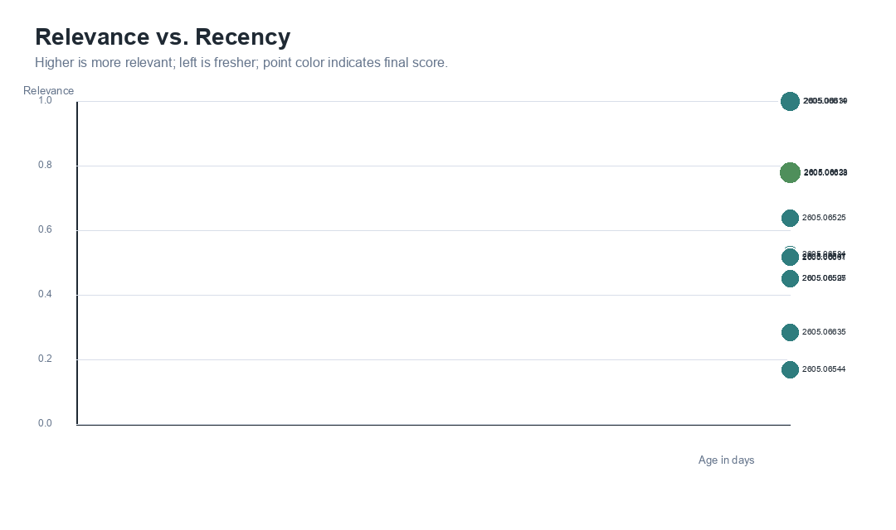
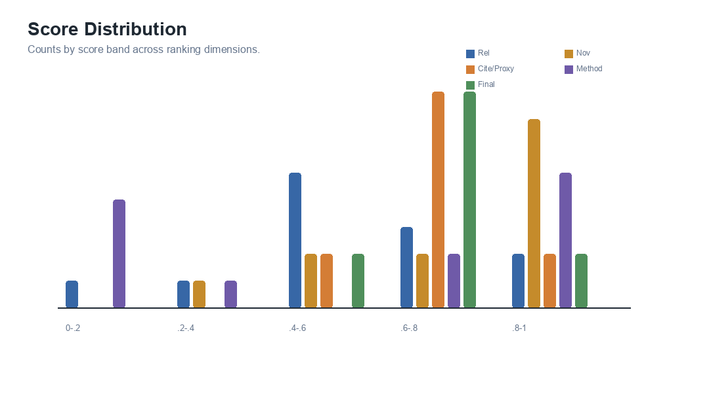
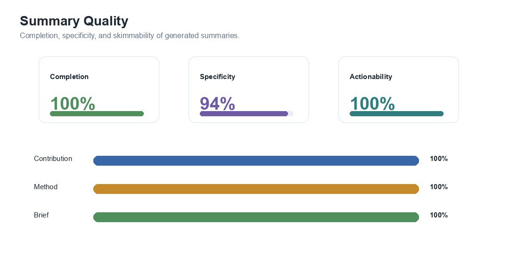
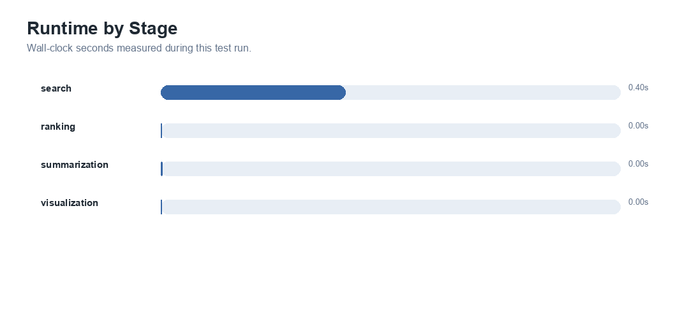

# Daily arXiv Briefing: Skill proof 1 - Agentic AI systems (2026-05-09)

## Executive Summary
Retrieved 35 recent arXiv papers and selected the top 12 for `Skill proof 1 - Agentic AI systems`.
The arXiv query was `(all:agentic OR all:agent OR all:multi-agent OR all:llm)`. Top-k coverage is 100% and median recency is 1 days.

## Evaluation Metrics
| Metric | Value |
|---|---:|
| Retrieved papers | 35 |
| Top-k papers | 12 |
| Overall quality score | 92/100 |
| Retrieval yield | 100% |
| Metadata completeness | 100% |
| Mean relevance | 0.594 |
| Max relevance | 1.000 |
| Relevance lift at k | 1.76x |
| High-value rate at k | 83% |
| Mean novelty | 0.812 |
| Mean citation/proxy score | 0.681 |
| Real citation coverage | 0% |
| Mean recency score | 0.933 |
| Mean method signal | 0.569 |
| Coverage at k | 100% |
| Category diversity | 8 |
| Category evenness | 0.917 |
| Freshness at k | 100% |
| Median recency | 1 days |
| Summary completion | 100% |
| Summary specificity | 94% |
| Brief actionability | 100% |
| Link completeness | 100% |
| Figure generation success | 100% |
| Runtime per paper | 0.01s |

## Visual Overview

*Grouped quality scorecard for the full briefing workflow.*

*Radar chart showing strengths and weaknesses across evaluation groups.*

*Top paper matrix showing why each paper was selected.*

*Primary category distribution for top ranked papers.*

*Relationship between paper recency, relevance, and final score.*

*Distribution of relevance, novelty, citation/proxy, method, and final scores.*

*Summary completion, specificity, and actionability.*

*Measured runtime for each workflow stage.*

## Summary Table
| Rank | Title | arXiv | Rel | Nov | Cite/Proxy | Recency | Method | Final | Category | Published | Links |
|---:|---|---|---:|---:|---:|---:|---:|---:|---|---|---|
| 1 | Can RL Teach Long-Horizon Reasoning to LLMs? Expressiveness Is Key | 2605.06638 | 0.777 | 1.000 | 0.694 | 0.933 | 1.000 | 0.847 | cs.AI | 2026-05-07 | [abs](http://arxiv.org/abs/2605.06638v1) / [pdf](https://arxiv.org/pdf/2605.06638v1) |
| 2 | MASPO: Joint Prompt Optimization for LLM-based Multi-Agent Systems | 2605.06623 | 0.780 | 1.000 | 0.844 | 0.933 | 0.667 | 0.838 | cs.AI | 2026-05-07 | [abs](http://arxiv.org/abs/2605.06623v1) / [pdf](https://arxiv.org/pdf/2605.06623v1) |
| 3 | Recursive Agent Optimization | 2605.06639 | 1.000 | 0.250 | 0.679 | 0.933 | 0.833 | 0.779 | cs.LG | 2026-05-07 | [abs](http://arxiv.org/abs/2605.06639v1) / [pdf](https://arxiv.org/pdf/2605.06639v1) |
| 4 | SkillOS: Learning Skill Curation for Self-Evolving Agents | 2605.06614 | 1.000 | 0.500 | 0.725 | 0.933 | 0.167 | 0.769 | cs.AI | 2026-05-07 | [abs](http://arxiv.org/abs/2605.06614v1) / [pdf](https://arxiv.org/pdf/2605.06614v1) |
| 5 | NeuroAgent: LLM Agents for Multimodal Neuroimaging Analysis and Research | 2605.06584 | 0.526 | 0.750 | 0.631 | 0.933 | 0.833 | 0.658 | cs.AI | 2026-05-07 | [abs](http://arxiv.org/abs/2605.06584v1) / [pdf](https://arxiv.org/pdf/2605.06584v1) |
| 6 | STALE: Can LLM Agents Know When Their Memories Are No Longer Valid? | 2605.06527 | 0.454 | 1.000 | 0.569 | 0.933 | 0.667 | 0.649 | cs.CL | 2026-05-07 | [abs](http://arxiv.org/abs/2605.06527v1) / [pdf](https://arxiv.org/pdf/2605.06527v1) |
| 7 | Cross-Modal Navigation with Multi-Agent Reinforcement Learning | 2605.06595 | 0.453 | 1.000 | 0.694 | 0.933 | 0.333 | 0.634 | cs.RO | 2026-05-07 | [abs](http://arxiv.org/abs/2605.06595v1) / [pdf](https://arxiv.org/pdf/2605.06595v1) |
| 8 | Patch2Vuln: Agentic Reconstruction of Vulnerabilities from Linux Distribution Binary Patches | 2605.06601 | 0.517 | 1.000 | 0.537 | 0.933 | 0.167 | 0.624 | cs.CR | 2026-05-07 | [abs](http://arxiv.org/abs/2605.06601v1) / [pdf](https://arxiv.org/pdf/2605.06601v1) |
| 9 | Cited but Not Verified: Parsing and Evaluating Source Attribution in LLM Deep Research Agents | 2605.06635 | 0.285 | 1.000 | 0.600 | 0.933 | 1.000 | 0.612 | cs.CL | 2026-05-07 | [abs](http://arxiv.org/abs/2605.06635v1) / [pdf](https://arxiv.org/pdf/2605.06635v1) |
| 10 | CCL-Bench 1.0: A Trace-Based Benchmark for LLM Infrastructure | 2605.06544 | 0.171 | 1.000 | 0.875 | 0.933 | 1.000 | 0.602 | cs.DC | 2026-05-07 | [abs](http://arxiv.org/abs/2605.06544v1) / [pdf](https://arxiv.org/pdf/2605.06544v1) |
| 11 | Superintelligent Retrieval Agent: The Next Frontier of Information Retrieval | 2605.06647 | 0.519 | 0.750 | 0.662 | 0.933 | 0.167 | 0.593 | cs.IR | 2026-05-07 | [abs](http://arxiv.org/abs/2605.06647v1) / [pdf](https://arxiv.org/pdf/2605.06647v1) |
| 12 | Sustaining Cooperation in Populations Guided by AI: A Folk Theorem for LLMs | 2605.06525 | 0.640 | 0.500 | 0.662 | 0.933 | 0.000 | 0.581 | cs.GT | 2026-05-07 | [abs](http://arxiv.org/abs/2605.06525v1) / [pdf](https://arxiv.org/pdf/2605.06525v1) |

## Highlighted Papers
### 1. Can RL Teach Long-Horizon Reasoning to LLMs? Expressiveness Is Key
- Authors: Tianle Wang, Zhaoyang Wang, Guangchen Lan, Xinpeng Wei, Sipeng Zhang, Guanwen Qiu
- Contribution: We introduce ScaleLogic, a synthetic logical reasoning framework that offers independent control over two axes of difficulty: the depth of the required proof planning (i.e., the horizon) and the expressiveness of the underlying logic.
- Method: Reinforcement learning (RL) has been applied to improve large language model (LLM) reasoning, yet the systematic study of how training scales with task difficulty has been hampered by the lack of controlled, scalable environments.
- Brief: cs.AI: We introduce ScaleLogic, a synthetic logical reasoning framework that offers independent control over two axes of difficulty: the depth of the required proof planning (i.e., the horizon) and the expressiveness of the underlying logic. Method signal: Reinforcement learning (RL) has been applied to improve large language model (LLM) reasoning, yet the systematic study of how training scales with task difficulty has been hampered by the lack of controlled, scalable environments.

### 2. MASPO: Joint Prompt Optimization for LLM-based Multi-Agent Systems
- Authors: Zhexuan Wang, Xuebo Liu, Li Wang, Zifei Shan, Yutong Wang, Zhenxi Song
- Contribution: To address this, we introduce MASPO, a novel framework designed to automatically and iteratively refine prompts across the entire system.
- Method: Large language model (LLM)-based Multi-agent systems (MAS) have shown promise in tackling complex collaborative tasks, where agents are typically orchestrated via role-specific prompts.
- Brief: cs.AI: To address this, we introduce MASPO, a novel framework designed to automatically and iteratively refine prompts across the entire system. Method signal: Large language model (LLM)-based Multi-agent systems (MAS) have shown promise in tackling complex collaborative tasks, where agents are typically orchestrated via role-specific prompts.

### 3. Recursive Agent Optimization
- Authors: Apurva Gandhi, Satyaki Chakraborty, Xiangjun Wang, Aviral Kumar, Graham Neubig
- Contribution: We introduce Recursive Agent Optimization (RAO), a reinforcement learning approach for training recursive agents: agents that can spawn and delegate sub-tasks to new instantiations of themselves recursively.
- Method: We introduce Recursive Agent Optimization (RAO), a reinforcement learning approach for training recursive agents: agents that can spawn and delegate sub-tasks to new instantiations of themselves recursively.
- Brief: cs.LG: We introduce Recursive Agent Optimization (RAO), a reinforcement learning approach for training recursive agents: agents that can spawn and delegate sub-tasks to new instantiations of themselves recursively. Method signal: We introduce Recursive Agent Optimization (RAO), a reinforcement learning approach for training recursive agents: agents that can spawn and delegate sub-tasks to new instantiations of themselves recursively.

### 4. SkillOS: Learning Skill Curation for Self-Evolving Agents
- Authors: Siru Ouyang, Jun Yan, Yanfei Chen, Rujun Han, Zifeng Wang, Bhavana Dalvi Mishra
- Contribution: To tackle this challenge, we propose SkillOS, an experience-driven RL training recipe for learning skill curation in self-evolving agents.
- Method: LLM-based agents are increasingly deployed to handle streaming tasks, yet they often remain one-off problem solvers that fail to learn from past interactions.
- Brief: cs.AI: To tackle this challenge, we propose SkillOS, an experience-driven RL training recipe for learning skill curation in self-evolving agents. Method signal: LLM-based agents are increasingly deployed to handle streaming tasks, yet they often remain one-off problem solvers that fail to learn from past interactions.

### 5. NeuroAgent: LLM Agents for Multimodal Neuroimaging Analysis and Research
- Authors: Lujia Zhong, Yihao Xia, Jianwei Zhang, Shuo huang, Jiaxin Yue, Mingyang Xia
- Contribution: We present NeuroAgent, an LLM-driven agentic framework that automates key preprocessing and analysis steps for heterogeneous neuroimaging data, including sMRI, fMRI, dMRI, and PET, and supports interactive downstream analysis through natural-language queries.
- Method: We present NeuroAgent, an LLM-driven agentic framework that automates key preprocessing and analysis steps for heterogeneous neuroimaging data, including sMRI, fMRI, dMRI, and PET, and supports interactive downstream analysis through natural-language queries.
- Brief: cs.AI: We present NeuroAgent, an LLM-driven agentic framework that automates key preprocessing and analysis steps for heterogeneous neuroimaging data, including sMRI, fMRI, dMRI, and PET, and supports interactive downstream analysis through natural-language queries. Method signal: We present NeuroAgent, an LLM-driven agentic framework that automates key preprocessing and analysis steps for heterogeneous neuroimaging data, including sMRI, fMRI, dMRI, and PET, and supports interactive downstream analysis through natural-language queries.

## Notes
- No blocking workflow warnings.
- Citation/proxy score uses real citation counts only when `citation_count` is present; otherwise it uses a labeled impact proxy from metadata and abstract signals.
- Output generated on 2026-05-09 using UTC+8 date boundaries.
