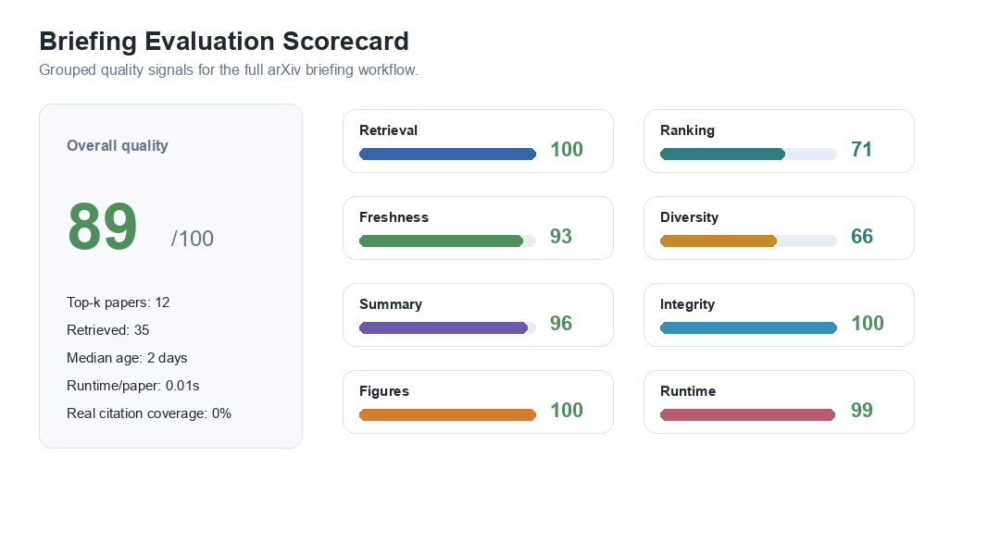
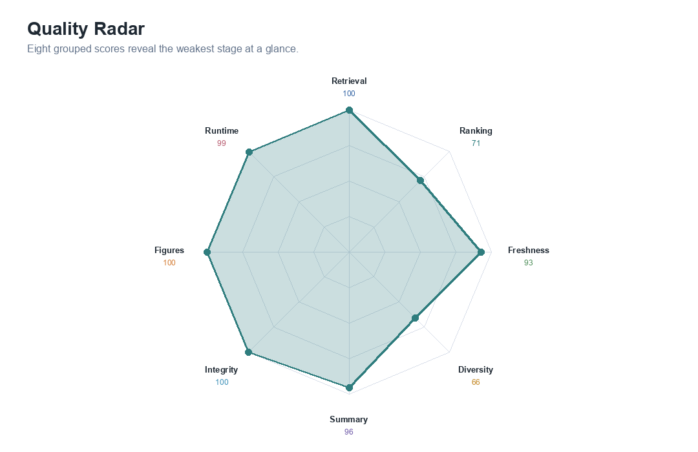
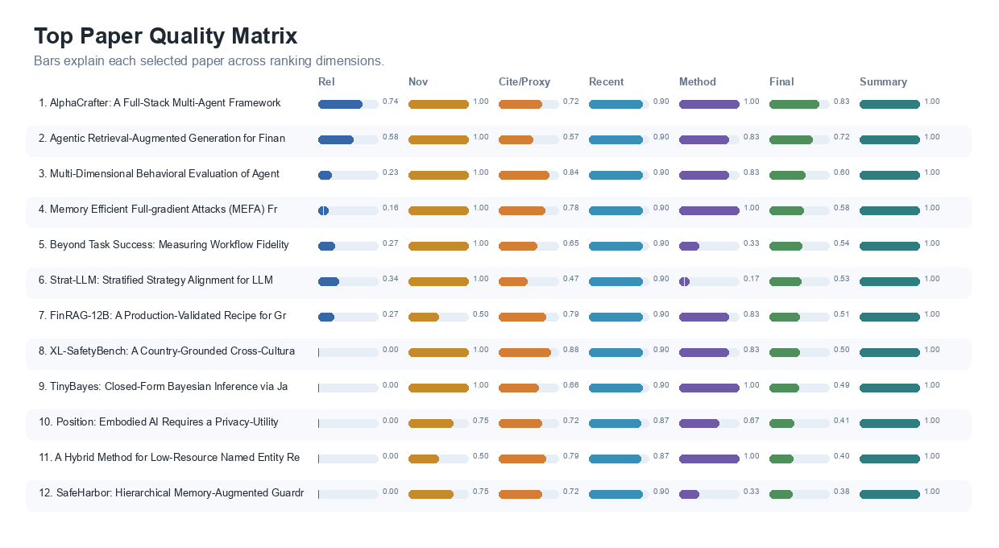
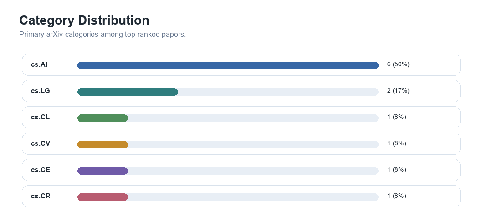
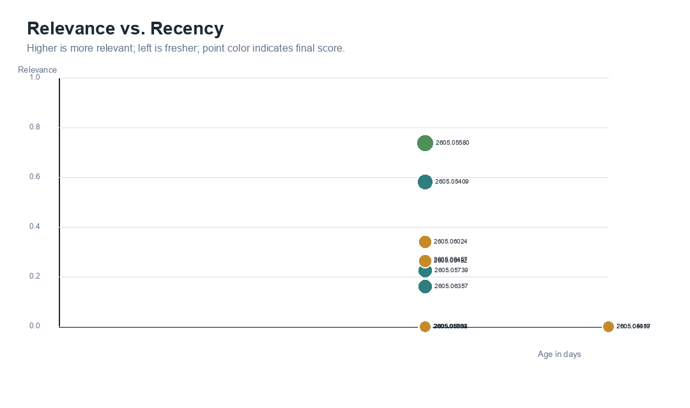
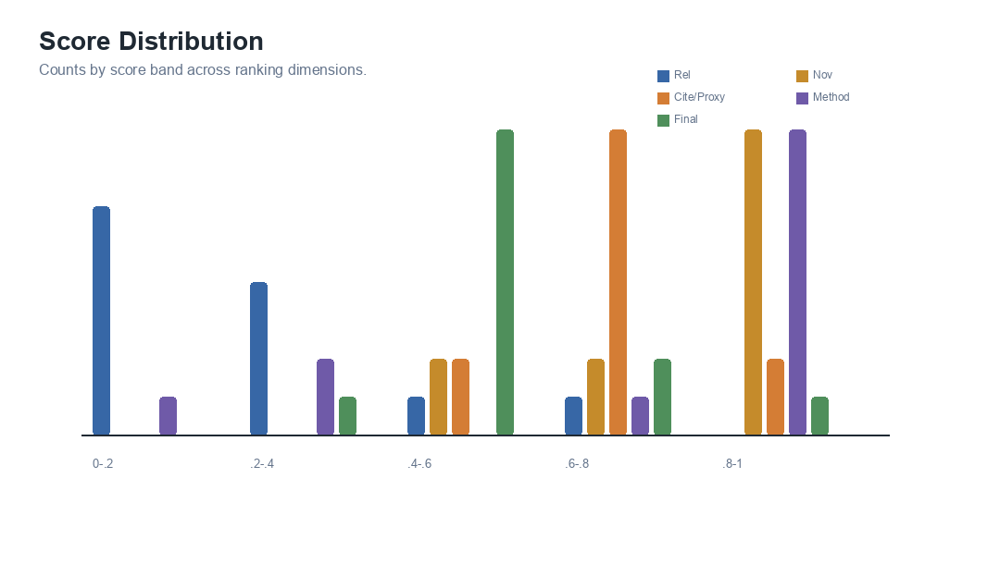
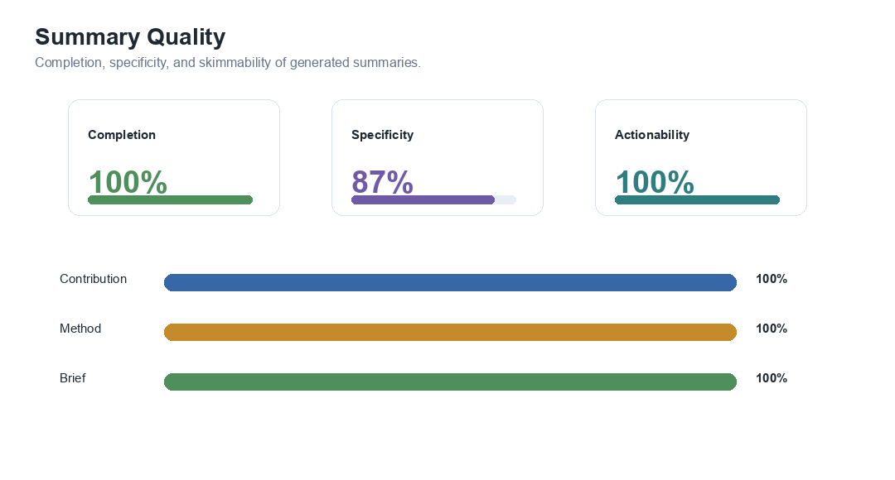
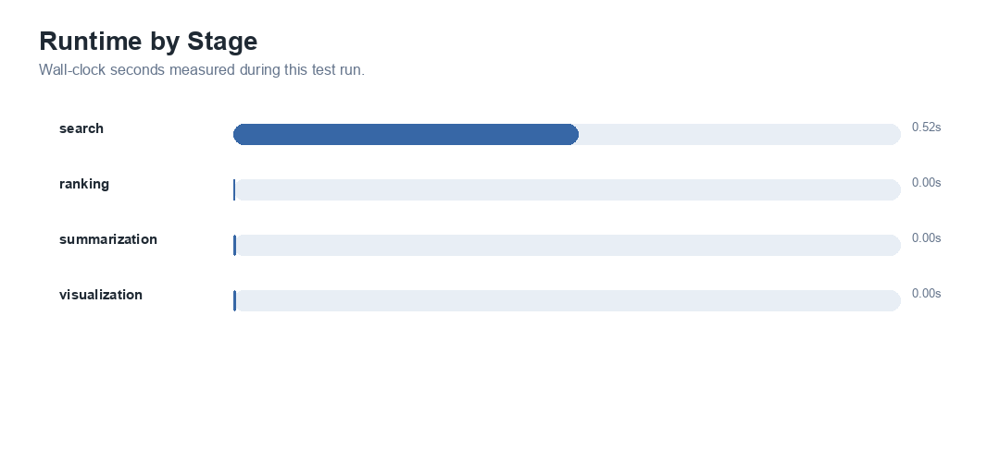

# Daily arXiv Briefing: Skill proof 2 - AI for finance (2026-05-09)

## Executive Summary
Retrieved 35 recent arXiv papers and selected the top 12 for `Skill proof 2 - AI for finance`.
The arXiv query was `all:"artificial intelligence" AND (all:finance OR all:financial OR all:trading OR all:stock)`. Top-k coverage is 58% and median recency is 2 days.

## Evaluation Metrics
| Metric | Value |
|---|---:|
| Retrieved papers | 35 |
| Top-k papers | 12 |
| Overall quality score | 89/100 |
| Retrieval yield | 100% |
| Metadata completeness | 100% |
| Mean relevance | 0.216 |
| Max relevance | 0.739 |
| Relevance lift at k | 2.92x |
| High-value rate at k | 100% |
| Mean novelty | 0.875 |
| Mean citation/proxy score | 0.717 |
| Real citation coverage | 0% |
| Mean recency score | 0.894 |
| Mean method signal | 0.736 |
| Coverage at k | 58% |
| Category diversity | 6 |
| Category evenness | 0.822 |
| Freshness at k | 100% |
| Median recency | 2 days |
| Summary completion | 100% |
| Summary specificity | 87% |
| Brief actionability | 100% |
| Link completeness | 100% |
| Figure generation success | 100% |
| Runtime per paper | 0.01s |

## Visual Overview

*Grouped quality scorecard for the full briefing workflow.*

*Radar chart showing strengths and weaknesses across evaluation groups.*

*Top paper matrix showing why each paper was selected.*

*Primary category distribution for top ranked papers.*

*Relationship between paper recency, relevance, and final score.*

*Distribution of relevance, novelty, citation/proxy, method, and final scores.*

*Summary completion, specificity, and actionability.*

*Measured runtime for each workflow stage.*

## Summary Table
| Rank | Title | arXiv | Rel | Nov | Cite/Proxy | Recency | Method | Final | Category | Published | Links |
|---:|---|---|---:|---:|---:|---:|---:|---:|---|---|---|
| 1 | AlphaCrafter: A Full-Stack Multi-Agent Framework for Cross-Sectional Quantitative Trading | 2605.05580 | 0.739 | 1.000 | 0.719 | 0.900 | 1.000 | 0.831 | cs.AI | 2026-05-07 | [abs](http://arxiv.org/abs/2605.05580v1) / [pdf](https://arxiv.org/pdf/2605.05580v1) |
| 2 | Agentic Retrieval-Augmented Generation for Financial Document Question Answering | 2605.05409 | 0.583 | 1.000 | 0.569 | 0.900 | 0.833 | 0.721 | cs.AI | 2026-05-06 | [abs](http://arxiv.org/abs/2605.05409v1) / [pdf](https://arxiv.org/pdf/2605.05409v1) |
| 3 | Multi-Dimensional Behavioral Evaluation of Agentic Stock Prediction Systems Using LLM Judges with Closed-Loop Reinforcement Learning Feedback | 2605.05739 | 0.228 | 1.000 | 0.844 | 0.900 | 0.833 | 0.603 | cs.LG | 2026-05-07 | [abs](http://arxiv.org/abs/2605.05739v1) / [pdf](https://arxiv.org/pdf/2605.05739v1) |
| 4 | Memory Efficient Full-gradient Attacks (MEFA) Framework for Adversarial Defense Evaluations | 2605.06357 | 0.163 | 1.000 | 0.781 | 0.900 | 1.000 | 0.580 | cs.LG | 2026-05-07 | [abs](http://arxiv.org/abs/2605.06357v1) / [pdf](https://arxiv.org/pdf/2605.06357v1) |
| 5 | Beyond Task Success: Measuring Workflow Fidelity in LLM-Based Agentic Payment Systems | 2605.06457 | 0.271 | 1.000 | 0.647 | 0.900 | 0.333 | 0.542 | cs.AI | 2026-05-07 | [abs](http://arxiv.org/abs/2605.06457v1) / [pdf](https://arxiv.org/pdf/2605.06457v1) |
| 6 | Strat-LLM: Stratified Strategy Alignment for LLM-based Stock Trading with Real-time Multi-Source Signals | 2605.06024 | 0.342 | 1.000 | 0.475 | 0.900 | 0.167 | 0.532 | cs.AI | 2026-05-07 | [abs](http://arxiv.org/abs/2605.06024v1) / [pdf](https://arxiv.org/pdf/2605.06024v1) |
| 7 | FinRAG-12B: A Production-Validated Recipe for Grounded Question Answering in Banking | 2605.05482 | 0.266 | 0.500 | 0.787 | 0.900 | 0.833 | 0.511 | cs.AI | 2026-05-06 | [abs](http://arxiv.org/abs/2605.05482v1) / [pdf](https://arxiv.org/pdf/2605.05482v1) |
| 8 | XL-SafetyBench: A Country-Grounded Cross-Cultural Benchmark for LLM Safety and Cultural Sensitivity | 2605.05662 | 0.000 | 1.000 | 0.875 | 0.900 | 0.833 | 0.505 | cs.CL | 2026-05-07 | [abs](http://arxiv.org/abs/2605.05662v1) / [pdf](https://arxiv.org/pdf/2605.05662v1) |
| 9 | TinyBayes: Closed-Form Bayesian Inference via Jacobi Prior for Real-Time Image Classification on Edge Devices | 2605.06333 | 0.000 | 1.000 | 0.662 | 0.900 | 1.000 | 0.489 | cs.CV | 2026-05-07 | [abs](http://arxiv.org/abs/2605.06333v1) / [pdf](https://arxiv.org/pdf/2605.06333v1) |
| 10 | Position: Embodied AI Requires a Privacy-Utility Trade-off | 2605.05017 | 0.000 | 0.750 | 0.725 | 0.867 | 0.667 | 0.412 | cs.AI | 2026-05-06 | [abs](http://arxiv.org/abs/2605.05017v1) / [pdf](https://arxiv.org/pdf/2605.05017v1) |
| 11 | A Hybrid Method for Low-Resource Named Entity Recognition | 2605.04489 | 0.000 | 0.500 | 0.787 | 0.867 | 1.000 | 0.405 | cs.CE | 2026-05-06 | [abs](http://arxiv.org/abs/2605.04489v1) / [pdf](https://arxiv.org/pdf/2605.04489v1) |
| 12 | SafeHarbor: Hierarchical Memory-Augmented Guardrail for LLM Agent Safety | 2605.05704 | 0.000 | 0.750 | 0.725 | 0.900 | 0.333 | 0.382 | cs.CR | 2026-05-07 | [abs](http://arxiv.org/abs/2605.05704v1) / [pdf](https://arxiv.org/pdf/2605.05704v1) |

## Highlighted Papers
### 1. AlphaCrafter: A Full-Stack Multi-Agent Framework for Cross-Sectional Quantitative Trading
- Authors: Yishuo Yuan, Jiayi Sheng, Sirui Zeng, Jiaqi Wang, Jiaheng Liu
- Contribution: We introduce AlphaCrafter, a full-stack multi-agent framework that closes this gap through a continuously adaptive factor-to-execution pipeline, designed to track and respond to evolving market conditions without manual intervention.
- Method: Prevailing approaches, however, optimize these components under static or isolated assumptions.
- Brief: cs.AI: We introduce AlphaCrafter, a full-stack multi-agent framework that closes this gap through a continuously adaptive factor-to-execution pipeline, designed to track and respond to evolving market conditions without manual intervention. Method signal: Prevailing approaches, however, optimize these components under static or isolated assumptions.

### 2. Agentic Retrieval-Augmented Generation for Financial Document Question Answering
- Authors: Yang Shu, Yingmin Liu, Zequn Xie
- Contribution: We propose FinAgent-RAG, an agentic RAG framework that orchestrates iterative retrieval-reasoning loops with self-verification, specifically engineered for the precision requirements of financial numerical reasoning.
- Method: Existing retrieval-augmented generation (RAG) approaches adopt a single-pass retrieve-then-generate paradigm that struggles with the compositional reasoning chains prevalent in financial analysis.
- Brief: cs.AI: We propose FinAgent-RAG, an agentic RAG framework that orchestrates iterative retrieval-reasoning loops with self-verification, specifically engineered for the precision requirements of financial numerical reasoning. Method signal: Existing retrieval-augmented generation (RAG) approaches adopt a single-pass retrieve-then-generate paradigm that struggles with the compositional reasoning chains prevalent in financial analysis.

### 3. Multi-Dimensional Behavioral Evaluation of Agentic Stock Prediction Systems Using LLM Judges with Closed-Loop Reinforcement Learning Feedback
- Authors: Mohammad Al Ridhawi, Mahtab Haj Ali, Hussein Al Osman
- Contribution: We present a behavioral evaluation framework that addresses this gap.
- Method: Agentic stock prediction systems make sequences of interdependent decisions (regime detection, pathway routing, reinforcement learning control) whose individual quality is hidden by aggregate metrics such as mean absolute percentage error (MAPE) or directional accuracy.
- Brief: cs.LG: We present a behavioral evaluation framework that addresses this gap. Method signal: Agentic stock prediction systems make sequences of interdependent decisions (regime detection, pathway routing, reinforcement learning control) whose individual quality is hidden by aggregate metrics such as mean absolute percentage error (MAPE) or directional accuracy.

### 4. Memory Efficient Full-gradient Attacks (MEFA) Framework for Adversarial Defense Evaluations
- Authors: Yuan Du, Mitchel Hill, HanQin Cai
- Contribution: Building on this insight, we introduce a memory-efficient full-gradient evaluation framework for stochastic purification defenses.
- Method: Building on this insight, we introduce a memory-efficient full-gradient evaluation framework for stochastic purification defenses.
- Brief: cs.LG: Building on this insight, we introduce a memory-efficient full-gradient evaluation framework for stochastic purification defenses. Method signal: Building on this insight, we introduce a memory-efficient full-gradient evaluation framework for stochastic purification defenses.

### 5. Beyond Task Success: Measuring Workflow Fidelity in LLM-Based Agentic Payment Systems
- Authors: Donghao Huang, Joon Kiat Chua, Zhaoxia Wang
- Contribution: We introduce the Agentic Success Rate (ASR), a trajectory-fidelity metric that compares observed and expected agent execution sequences at the transition level, decomposing performance into Transition Recall and Transition Precision.
- Method: LLM-based multi-agent systems are increasingly deployed for payment workflows, yet prevailing metrics, Task Success Rate (TSR) and Agent Handoff F1-Score (HF1), capture only final outcomes or unordered routing decisions.
- Brief: cs.AI: We introduce the Agentic Success Rate (ASR), a trajectory-fidelity metric that compares observed and expected agent execution sequences at the transition level, decomposing performance into Transition Recall and Transition Precision. Method signal: LLM-based multi-agent systems are increasingly deployed for payment workflows, yet prevailing metrics, Task Success Rate (TSR) and Agent Handoff F1-Score (HF1), capture only final outcomes or unordered routing decisions.

## Notes
- No blocking workflow warnings.
- Citation/proxy score uses real citation counts only when `citation_count` is present; otherwise it uses a labeled impact proxy from metadata and abstract signals.
- Output generated on 2026-05-09 using UTC+8 date boundaries.
