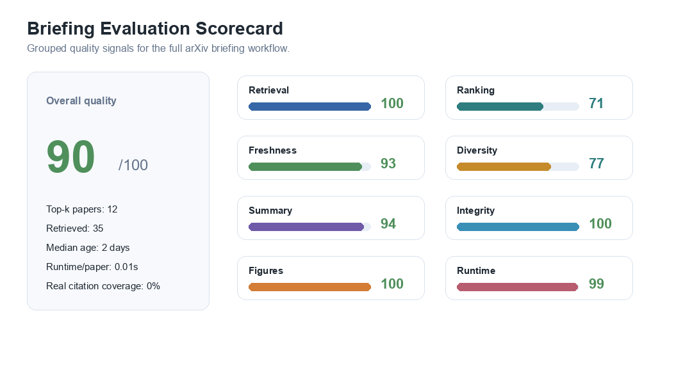
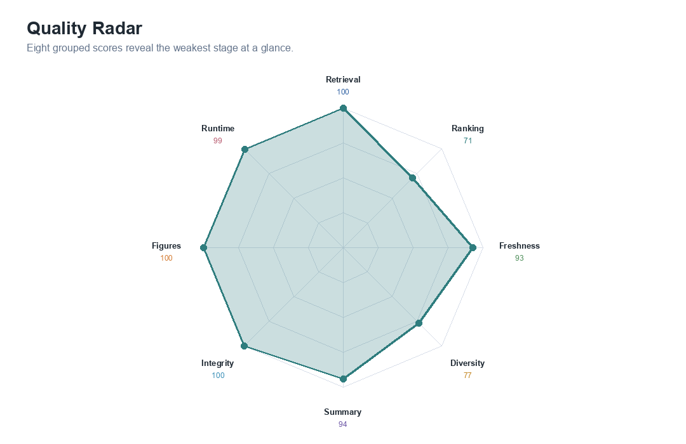
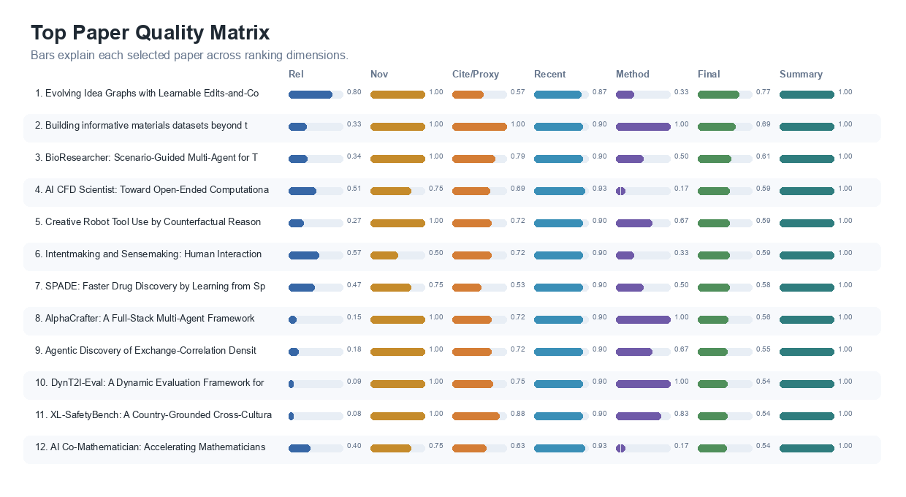
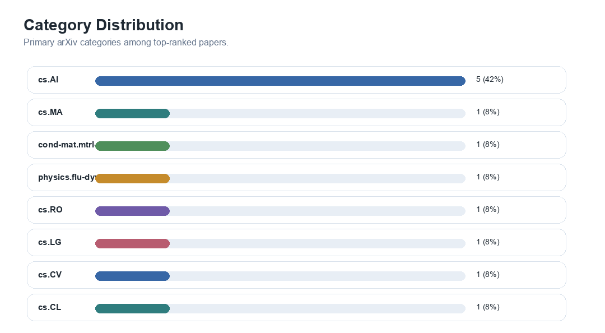
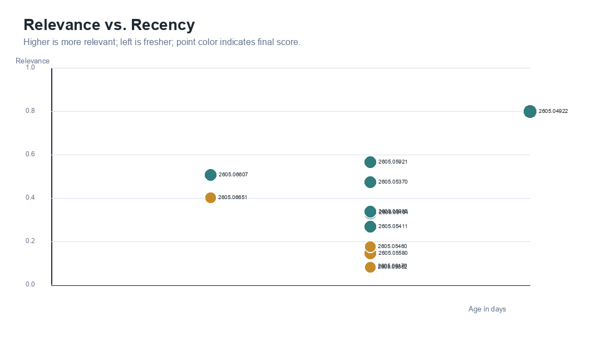
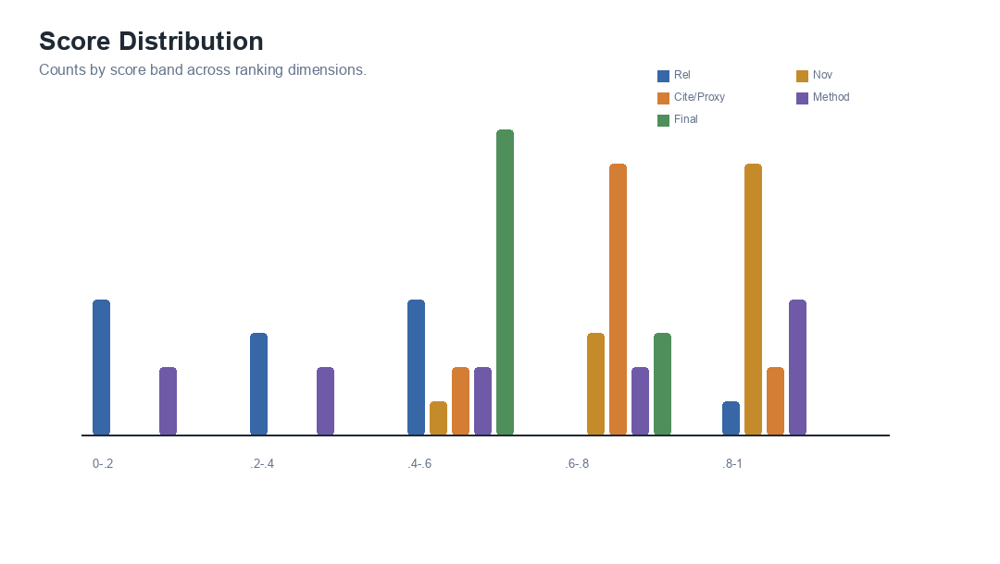
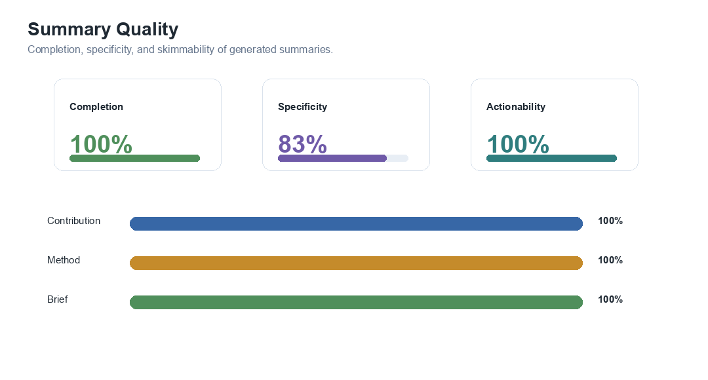
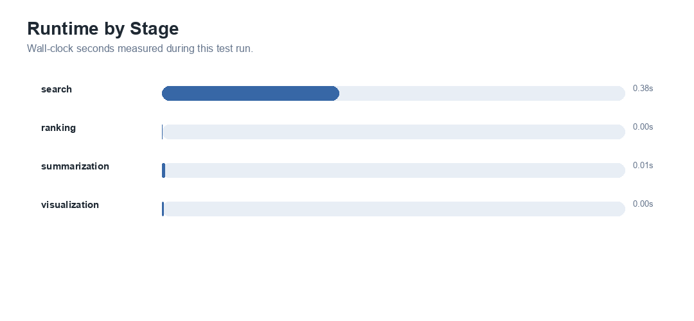

# Daily arXiv Briefing: Skill proof 3 - AI for scientific discovery (2026-05-09)

## Executive Summary
Retrieved 35 recent arXiv papers and selected the top 12 for `Skill proof 3 - AI for scientific discovery`.
The arXiv query was `(all:scientific AND all:discovery) OR (all:science AND all:discovery) OR (all:research AND all:discovery)`. Top-k coverage is 100% and median recency is 2 days.

## Evaluation Metrics
| Metric | Value |
|---|---:|
| Retrieved papers | 35 |
| Top-k papers | 12 |
| Overall quality score | 90/100 |
| Retrieval yield | 100% |
| Metadata completeness | 100% |
| Mean relevance | 0.350 |
| Max relevance | 0.801 |
| Relevance lift at k | 1.63x |
| High-value rate at k | 75% |
| Mean novelty | 0.896 |
| Mean citation/proxy score | 0.726 |
| Real citation coverage | 0% |
| Mean recency score | 0.903 |
| Mean method signal | 0.597 |
| Coverage at k | 100% |
| Category diversity | 8 |
| Category evenness | 0.873 |
| Freshness at k | 100% |
| Median recency | 2 days |
| Summary completion | 100% |
| Summary specificity | 83% |
| Brief actionability | 100% |
| Link completeness | 100% |
| Figure generation success | 100% |
| Runtime per paper | 0.01s |

## Visual Overview

*Grouped quality scorecard for the full briefing workflow.*

*Radar chart showing strengths and weaknesses across evaluation groups.*

*Top paper matrix showing why each paper was selected.*

*Primary category distribution for top ranked papers.*

*Relationship between paper recency, relevance, and final score.*

*Distribution of relevance, novelty, citation/proxy, method, and final scores.*

*Summary completion, specificity, and actionability.*

*Measured runtime for each workflow stage.*

## Summary Table
| Rank | Title | arXiv | Rel | Nov | Cite/Proxy | Recency | Method | Final | Category | Published | Links |
|---:|---|---|---:|---:|---:|---:|---:|---:|---|---|---|
| 1 | Evolving Idea Graphs with Learnable Edits-and-Commits for Multi-Agent Scientific Ideation | 2605.04922 | 0.801 | 1.000 | 0.569 | 0.867 | 0.333 | 0.766 | cs.MA | 2026-05-06 | [abs](http://arxiv.org/abs/2605.04922v1) / [pdf](https://arxiv.org/pdf/2605.04922v1) |
| 2 | Building informative materials datasets beyond targeted objectives | 2605.05104 | 0.335 | 1.000 | 1.000 | 0.900 | 1.000 | 0.691 | cond-mat.mtrl-sci | 2026-05-06 | [abs](http://arxiv.org/abs/2605.05104v1) / [pdf](https://arxiv.org/pdf/2605.05104v1) |
| 3 | BioResearcher: Scenario-Guided Multi-Agent for Translational Medicine | 2605.05985 | 0.339 | 1.000 | 0.787 | 0.900 | 0.500 | 0.611 | cs.AI | 2026-05-07 | [abs](http://arxiv.org/abs/2605.05985v1) / [pdf](https://arxiv.org/pdf/2605.05985v1) |
| 4 | AI CFD Scientist: Toward Open-Ended Computational Fluid Dynamics Discovery with Physics-Aware AI Agents | 2605.06607 | 0.508 | 0.750 | 0.694 | 0.933 | 0.167 | 0.593 | physics.flu-dyn | 2026-05-07 | [abs](http://arxiv.org/abs/2605.06607v1) / [pdf](https://arxiv.org/pdf/2605.06607v1) |
| 5 | Creative Robot Tool Use by Counterfactual Reasoning | 2605.05411 | 0.272 | 1.000 | 0.725 | 0.900 | 0.667 | 0.588 | cs.RO | 2026-05-06 | [abs](http://arxiv.org/abs/2605.05411v1) / [pdf](https://arxiv.org/pdf/2605.05411v1) |
| 6 | Intentmaking and Sensemaking: Human Interaction with AI-Guided Mathematical Discovery | 2605.05921 | 0.567 | 0.500 | 0.717 | 0.900 | 0.333 | 0.586 | cs.AI | 2026-05-07 | [abs](http://arxiv.org/abs/2605.05921v1) / [pdf](https://arxiv.org/pdf/2605.05921v1) |
| 7 | SPADE: Faster Drug Discovery by Learning from Sparse Data | 2605.05370 | 0.475 | 0.750 | 0.527 | 0.900 | 0.500 | 0.583 | cs.LG | 2026-05-06 | [abs](http://arxiv.org/abs/2605.05370v1) / [pdf](https://arxiv.org/pdf/2605.05370v1) |
| 8 | AlphaCrafter: A Full-Stack Multi-Agent Framework for Cross-Sectional Quantitative Trading | 2605.05580 | 0.148 | 1.000 | 0.719 | 0.900 | 1.000 | 0.564 | cs.AI | 2026-05-07 | [abs](http://arxiv.org/abs/2605.05580v1) / [pdf](https://arxiv.org/pdf/2605.05580v1) |
| 9 | Agentic Discovery of Exchange-Correlation Density Functionals | 2605.05460 | 0.178 | 1.000 | 0.725 | 0.900 | 0.667 | 0.546 | cs.AI | 2026-05-06 | [abs](http://arxiv.org/abs/2605.05460v1) / [pdf](https://arxiv.org/pdf/2605.05460v1) |
| 10 | DynT2I-Eval: A Dynamic Evaluation Framework for Text-to-Image Models | 2605.06170 | 0.089 | 1.000 | 0.750 | 0.900 | 1.000 | 0.543 | cs.CV | 2026-05-07 | [abs](http://arxiv.org/abs/2605.06170v1) / [pdf](https://arxiv.org/pdf/2605.06170v1) |
| 11 | XL-SafetyBench: A Country-Grounded Cross-Cultural Benchmark for LLM Safety and Cultural Sensitivity | 2605.05662 | 0.083 | 1.000 | 0.875 | 0.900 | 0.833 | 0.542 | cs.CL | 2026-05-07 | [abs](http://arxiv.org/abs/2605.05662v1) / [pdf](https://arxiv.org/pdf/2605.05662v1) |
| 12 | AI Co-Mathematician: Accelerating Mathematicians with Agentic AI | 2605.06651 | 0.404 | 0.750 | 0.628 | 0.933 | 0.167 | 0.536 | cs.AI | 2026-05-07 | [abs](http://arxiv.org/abs/2605.06651v1) / [pdf](https://arxiv.org/pdf/2605.06651v1) |

## Highlighted Papers
### 1. Evolving Idea Graphs with Learnable Edits-and-Commits for Multi-Agent Scientific Ideation
- Authors: Jiangwen Dong, Bo Li, Wanyu Lin
- Contribution: To this end, we introduce \textbf{Evolving Idea Graphs} (EIG), a graph-based multi-agent scientific ideation framework that can generate high-performance research ideas across various benchmark-native metrics, such as novelty, feasibility, and clarity.
- Method: LLM-empowered multi-agent systems offer new potential to accelerate scientific discovery by generating novel research ideas.
- Brief: cs.MA: To this end, we introduce \textbf{Evolving Idea Graphs} (EIG), a graph-based multi-agent scientific ideation framework that can generate high-performance research ideas across various benchmark-native metrics, such as novelty, feasibility, and clarity. Method signal: LLM-empowered multi-agent systems offer new potential to accelerate scientific discovery by generating novel research ideas.

### 2. Building informative materials datasets beyond targeted objectives
- Authors: Rafael Espinosa Castañeda, Ashley Dale, Hongchen Wang, Yonatan Kurniawan, Hao Wan, Runze Zhang
- Contribution: Here, we present a framework for dataset construction that maximizes informativeness for target properties of interest while preserving performance on untargeted ones.
- Method: Here, we present a framework for dataset construction that maximizes informativeness for target properties of interest while preserving performance on untargeted ones.
- Brief: cond-mat.mtrl-sci: Here, we present a framework for dataset construction that maximizes informativeness for target properties of interest while preserving performance on untargeted ones. Method signal: Here, we present a framework for dataset construction that maximizes informativeness for target properties of interest while preserving performance on untargeted ones.

### 3. BioResearcher: Scenario-Guided Multi-Agent for Translational Medicine
- Authors: Remigiusz Kinas, Joanna Krawczyk, Rafał Powalski, Przemysław Pietrzak, Agnieszka Kowalewska, Krzysztof Kolmus
- Contribution: Translational medicine turns underspecified development goals into evidence synthesis that must combine literature, trials, patents, and quantitative multi-omics analysis while preserving identifiers, uncertainty, and retrievable provenance.
- Method: General-purpose foundation models and off-the-shelf tool-augmented or multi-agent systems are not built for this: they tend to produce single-shot answers or run open-endedly, and fall short on the auditable, scenario-specific workflows that heterogeneous biomedical sources demand.
- Brief: cs.AI: Translational medicine turns underspecified development goals into evidence synthesis that must combine literature, trials, patents, and quantitative multi-omics analysis while preserving identifiers, uncertainty, and retrievable provenance. Method signal: General-purpose foundation models and off-the-shelf tool-augmented or multi-agent systems are not built for this: they tend to produce single-shot answers or run open-endedly, and fall short on the auditable, scenario-specific workflows that heterogeneous biomedical sources demand.

### 4. AI CFD Scientist: Toward Open-Ended Computational Fluid Dynamics Discovery with Physics-Aware AI Agents
- Authors: Nithin Somasekharan, Rabi Pathak, Manushri Dhanakoti, Tingwen Zhang, Ling Yue, Andy Zhu
- Contribution: We present AI CFD Scientist, an open-source AI scientist for computational fluid dynamics (CFD) that, to our knowledge, is the first to span literature-grounded ideation, validated execution, vision-based physics verification, source-code modification, and figure-grounded writing within a single inspectable workflow.
- Method: Recent LLM-based agents have closed substantial portions of the scientific discovery loop in software-only machine-learning research, in chemistry, and in biology.
- Brief: physics.flu-dyn: We present AI CFD Scientist, an open-source AI scientist for computational fluid dynamics (CFD) that, to our knowledge, is the first to span literature-grounded ideation, validated execution, vision-based physics verification, source-code modification, and figure-grounded writing within a single inspectable workflow. Method signal: Recent LLM-based agents have closed substantial portions of the scientific discovery loop in software-only machine-learning research, in chemistry, and in biology.

### 5. Creative Robot Tool Use by Counterfactual Reasoning
- Authors: M. Tuluhan Akbulut, Varun Satheesh, Ahmed Jaafar, Alper Ahmetoglu, Shane Parr, Aditya Ganeshan
- Contribution: We propose a causal reasoning framework for creative robot tool use where a suitable tool for a task is correctly identified for use beyond its primary objectives.
- Method: We propose a causal reasoning framework for creative robot tool use where a suitable tool for a task is correctly identified for use beyond its primary objectives.
- Brief: cs.RO: We propose a causal reasoning framework for creative robot tool use where a suitable tool for a task is correctly identified for use beyond its primary objectives. Method signal: We propose a causal reasoning framework for creative robot tool use where a suitable tool for a task is correctly identified for use beyond its primary objectives.

## Notes
- No blocking workflow warnings.
- Citation/proxy score uses real citation counts only when `citation_count` is present; otherwise it uses a labeled impact proxy from metadata and abstract signals.
- Output generated on 2026-05-09 using UTC+8 date boundaries.
